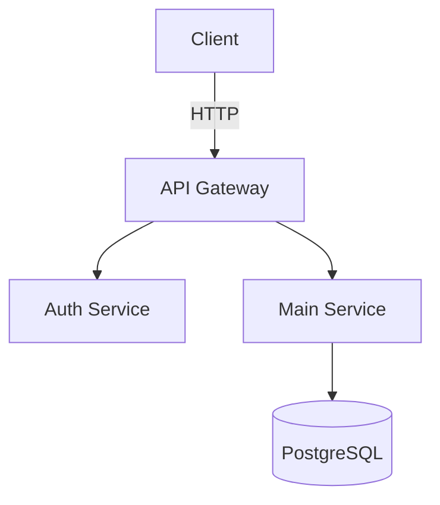

# 벨로그 반자동 블로그 시스템 - 상세 계획서

> **프로젝트명:** Post-CS
> **작성일:** 2026-02-11
> **대상 플랫폼:** Velog
> **목적:** 취업 준비용 기술 블로그 반자동 생성 및 발행

---

## 1. 프로젝트 배경 및 목표

### 배경
- 취업 준비 중인 개발자가 하루 1~2개의 기술 블로그 포스트를 꾸준히 발행하고자 함
- 글 작성에 드는 시간을 줄이되, 글의 품질과 본인의 이해도는 유지해야 함
- 완전 자동화가 아닌 **반자동화**를 통해 면접 대비 가능한 수준의 글을 유지

### 목표
1. 주제와 키포인트만 입력하면 AI가 블로그 초안을 생성
2. 검토/수정 후 명령어 한 번으로 벨로그에 자동 발행
3. 기술 다이어그램과 썸네일 이미지를 자동 생성/삽입
4. 하루 1~2개 포스팅 가능한 워크플로우 구축

### "반자동화"의 정의

| 단계 | 자동 | 수동 (내가 직접) |
|------|------|------------------|
| 주제 선정 | | O |
| 핵심 키포인트 작성 | | O |
| 블로그 본문 초안 | O (AI 생성) | |
| 코드 예제 생성 | O (AI 생성) | |
| 기술 다이어그램 | O (Mermaid 코드 생성) | |
| 썸네일 이미지 | O (이미지 모델 생성) | |
| Notion 업로드 | O (Notion API) | |
| 초안 검토 및 수정 | | O (Notion에서, 필수) |
| 벨로그 업로드 | O (GraphQL/Playwright) | |
| 태그/카테고리 설정 | O (YAML에서 읽음) | |

**핵심 원칙:** 모든 발행 글은 반드시 본인이 읽고, 이해하고, 수정한 상태여야 한다.

---

## 2. 전체 아키텍처

```
┌──────────────────────────────────────────────────────────┐
│                      사용자 영역                           │
│                                                           │
│   [topics.yaml]  ←── 주제 + 키포인트 작성                  │
│        │                                                  │
│        ▼                                                  │
│   $ python main.py generate                               │
│        │                                                  │
├────────┼──────────────────────────────────────────────────┤
│        │              시스템 영역                           │
│        ▼                                                  │
│   ┌──────────────────┐    ┌─────────────────────┐         │
│   │  Content Generator│───▶│  온프레미스 LLM 서버  │         │
│   │  (본문 생성)       │    │  (커스텀 API)        │         │
│   └────────┬─────────┘    └─────────────────────┘         │
│            │                                              │
│            ▼                                              │
│   ┌──────────────────┐    ┌─────────────────────┐         │
│   │  Thumbnail Gen    │───▶│  온프레미스 이미지 서버│         │
│   │  (썸네일 생성)     │    │  (커스텀 API)        │         │
│   └────────┬─────────┘    └─────────────────────┘         │
│            │                                              │
│            ▼                                              │
│   ┌──────────────────┐                                    │
│   │  Draft Manager    │──▶ drafts/{id}/ (로컬 백업)        │
│   └────────┬─────────┘                                    │
│            │                                              │
│            ▼                                              │
│   $ python main.py upload                                 │
│            │                                              │
│            ▼                                              │
│   ┌──────────────────┐    ┌─────────────────────┐         │
│   │  Notion Uploader  │───▶│  Notion API          │         │
│   │  (MD→블록 변환)    │    │  (공식, 안정적)       │         │
│   │  (이미지 업로드)   │    │                      │         │
│   └──────────────────┘    └─────────────────────┘         │
│                                                           │
├───────────────────────────────────────────────────────────┤
│                      사용자 영역                           │
│                                                           │
│   Notion DB (칸반 보드)  ←── 검토 및 수정                   │
│   - 코드 블록 + Mermaid 렌더링 상태로 검토                    │
│   - 모바일에서도 검토 가능                                   │
│   - Status: "Draft" → "Ready to Publish"                  │
│        │                                                  │
│        ▼                                                  │
│   $ python main.py publish                                │
│        │                                                  │
├────────┼──────────────────────────────────────────────────┤
│        │              시스템 영역                           │
│        ▼                                                  │
│   ┌──────────────────┐    Notion 블록 → 마크다운 변환       │
│   │  Notion Exporter  │                                    │
│   └────────┬─────────┘                                    │
│            │                                              │
│            ▼                                              │
│   ┌──────────────────┐    ┌─────────────────────┐         │
│   │  Velog Publisher   │───▶│  GraphQL API (기본)   │         │
│   │  (벨로그 발행)     │    │  Playwright (폴백)    │         │
│   └──────────────────┘    └─────────────────────┘         │
│            │                                              │
│            ▼                                              │
│   Notion Status → "Published" + 벨로그 URL 저장            │
│                                                           │
└───────────────────────────────────────────────────────────┘
```

---

## 3. 입력 시스템 상세 설계

### 3.1 topics.yaml 스키마

```yaml
# config/topics.yaml

posts:
  - id: "2026-02-12-python-gil"           # 고유 ID (날짜-슬러그)
    topic: "Python GIL 완전 정복"           # 글 제목
    keypoints:                              # 핵심 포인트 (AI 가이드용)
      - "GIL이 필요한 이유 (CPython 메모리 관리)"
      - "멀티스레딩 vs 멀티프로세싱 성능 비교"
      - "GIL 우회 방법 3가지"
      - "실무에서 언제 threading을 쓰는가"
    tags: ["Python", "GIL", "동시성"]       # 벨로그 태그
    tone: "tutorial"                        # 글 스타일
    series: "Python 심화"                   # 벨로그 시리즈 (선택)
    schedule: "2026-02-12 09:00"            # 예약 발행 시간
    status: "pending"                       # 상태 관리
    thumbnail_prompt: "Python GIL lock mechanism, technical diagram"  # 썸네일 프롬프트 (선택)
```

### 3.2 상태 머신

```
pending ──[generate]──▶ drafted ──[upload]──▶ in_notion ──[Notion에서 검토]──▶ ready ──[publish]──▶ published
            │                                    │                                        │
            └──[재생성]──▶ pending                 └──[Notion에서 수정 중]                    └──[실패]──▶ failed
```

| 상태 | 의미 | 위치 | 다음 액션 |
|------|------|------|-----------|
| `pending` | 주제만 입력된 상태 | topics.yaml | `generate` 명령으로 초안 생성 |
| `drafted` | AI 초안이 로컬에 생성됨 | drafts/{id}/ | `upload` 명령으로 Notion에 업로드 |
| `in_notion` | Notion DB에 업로드됨 | Notion | 사용자가 Notion에서 검토/수정 |
| `ready` | 사용자가 Notion에서 검토 완료 | Notion | `publish` 명령으로 벨로그 발행 |
| `published` | 벨로그에 발행 완료 | Notion + Velog | 완료 (벨로그 URL 저장) |
| `failed` | 발행 실패 | Notion | 에러 로그 확인 후 재시도 |

### 3.3 tone별 프롬프트 템플릿

각 tone에 대해 별도의 프롬프트 템플릿을 관리한다.

**`config/prompt_templates/tutorial.txt`**
```
당신은 시니어 백엔드 개발자이며 기술 블로그 작가입니다.
아래 주제에 대해 **튜토리얼 형식**의 기술 블로그 글을 작성하세요.

## 작성 규칙
1. 독자는 주니어~미드레벨 개발자입니다
2. H2(##), H3(###)로 명확히 구조화하세요
3. 각 섹션마다 실행 가능한 코드 예제를 포함하세요
4. 핵심 개념은 비유를 들어 쉽게 설명하세요
5. 적절한 위치에 Mermaid 다이어그램 코드를 포함하세요
6. 마지막에 "정리" 섹션으로 핵심 요약하세요
7. 확실하지 않은 정보는 포함하지 마세요
8. 전체 분량: 2000~3000자

## 주제
{topic}

## 반드시 포함할 핵심 포인트
{keypoints}
```

**`config/prompt_templates/deep-dive.txt`**
```
당신은 시니어 백엔드 개발자이며 기술 블로그 작가입니다.
아래 주제에 대해 **심층 분석** 기술 블로그 글을 작성하세요.

## 작성 규칙
1. 내부 동작 원리와 구현 레벨까지 파고드세요
2. "왜(Why)"에 집중하여 설명하세요
3. 아키텍처 또는 흐름을 보여주는 Mermaid 다이어그램을 2개 이상 포함하세요
4. 소스 코드 레벨의 예시가 있으면 포함하세요
5. 일반적인 오해나 함정(pitfall)을 짚어주세요
6. 전체 분량: 3000~5000자

## 주제
{topic}

## 반드시 포함할 핵심 포인트
{keypoints}
```

**`config/prompt_templates/comparison.txt`**
```
당신은 시니어 백엔드 개발자이며 기술 블로그 작가입니다.
아래 주제에 대해 **비교 분석** 기술 블로그 글을 작성하세요.

## 작성 규칙
1. 비교 대상을 명확히 정의하세요
2. 비교 표(Markdown table)를 반드시 포함하세요
3. 각 항목의 장단점을 균형있게 서술하세요
4. "언제 무엇을 써야 하는가" 결론을 내려주세요
5. 실제 사용 시나리오별 추천을 포함하세요
6. 전체 분량: 2000~3000자

## 주제
{topic}

## 반드시 포함할 핵심 포인트
{keypoints}
```

**`config/prompt_templates/til.txt`**
```
당신은 개발자이며 TIL(Today I Learned) 블로그를 작성합니다.
아래 주제에 대해 짧고 핵심적인 TIL 글을 작성하세요.

## 작성 규칙
1. 핵심만 간결하게 작성하세요
2. "문제 상황 → 원인 → 해결" 구조로 작성하세요
3. 코드 예시는 최소한으로 포함하세요
4. 전체 분량: 500~1000자

## 주제
{topic}

## 핵심 포인트
{keypoints}
```

---

## 4. 콘텐츠 생성 파이프라인 상세

### 4.1 본문 생성 흐름

```
topics.yaml에서 pending 항목 읽기
        │
        ▼
tone에 맞는 프롬프트 템플릿 로드
        │
        ▼
{topic}, {keypoints} 치환
        │
        ▼
온프레미스 LLM 서버 API 호출
        │
        ▼
응답 마크다운을 drafts/{id}/post.md 로 로컬 저장
        │
        ▼
status를 "drafted"로 변경

[upload 명령 실행 시]
        │
        ▼
마크다운 → Notion 블록 변환 (md_to_blocks.py)
        │
        ▼
Notion DB에 페이지 생성 (제목, 태그, 상태, 썸네일 포함)
        │
        ▼
status를 "in_notion"으로 변경
```

### 4.2 커스텀 API 어댑터 설계

온프레미스 서버가 커스텀 API이므로, 어댑터 패턴으로 감싸서 내부적으로는 통일된 인터페이스를 사용한다.

```python
# src/api/llm_client.py 설계

class LLMClient:
    """온프레미스 LLM 서버 어댑터"""

    def __init__(self, base_url, api_key=None, headers=None):
        self.base_url = base_url      # .env에서 로드
        self.api_key = api_key
        self.headers = headers or {}

    def generate(self, prompt: str, max_tokens: int = 4096) -> str:
        """
        LLM에 프롬프트를 보내고 텍스트 응답을 받는다.

        커스텀 API의 요청/응답 형식에 맞게 이 메서드 내부를 수정.
        외부에서는 항상 generate(prompt) -> str 로만 호출.
        """
        # TODO: 실제 서버의 API 스펙에 맞게 구현
        # 예시:
        # POST {base_url}/generate
        # Body: {"prompt": prompt, "max_tokens": max_tokens}
        # Response: {"text": "생성된 텍스트"}
        pass
```

```python
# src/api/image_client.py 설계

class ImageClient:
    """온프레미스 이미지 모델 서버 어댑터"""

    def __init__(self, base_url, api_key=None, headers=None):
        self.base_url = base_url
        self.api_key = api_key
        self.headers = headers or {}

    def generate(self, prompt: str, size: str = "1200x630") -> bytes:
        """
        이미지 생성 프롬프트를 보내고 이미지 바이너리를 받는다.

        커스텀 API의 요청/응답 형식에 맞게 이 메서드 내부를 수정.
        외부에서는 항상 generate(prompt) -> bytes 로만 호출.
        """
        # TODO: 실제 서버의 API 스펙에 맞게 구현
        pass
```

**이 패턴의 장점:**
- 나중에 모델을 교체해도 (예: 온프레미스 → OpenAI) 어댑터만 수정하면 됨
- 나머지 코드는 `generate(prompt) -> str` 인터페이스만 알면 됨

### 4.3 다이어그램 처리

벨로그는 Mermaid 코드 블록을 자체 렌더링하므로, **LLM이 생성한 Mermaid 코드를 그대로 유지**하는 것이 가장 간단하다.

```markdown
## 시스템 아키텍처


```

벨로그에서 위 코드는 자동으로 다이어그램으로 렌더링된다.

**대안:** 로컬에서 PNG로 렌더링이 필요한 경우
```bash
# mermaid-cli 설치
npm install -g @mermaid-js/mermaid-cli

# Mermaid 코드 → PNG 변환
mmdc -i diagram.mmd -o diagram.png -t dark -b transparent
```

### 4.4 썸네일 생성

```
글 제목 + thumbnail_prompt (또는 자동 생성된 프롬프트)
        │
        ▼
온프레미스 이미지 모델 API 호출
        │
        ▼
thumbnails/{id}.png 저장 (1200x630 권장)
        │
        ▼
발행 시 Playwright가 썸네일로 업로드
```

썸네일 프롬프트 자동 생성 전략:
- `thumbnail_prompt`가 topics.yaml에 있으면 그대로 사용
- 없으면 LLM에게 "이 주제에 맞는 썸네일 이미지 프롬프트를 한 줄로 만들어줘"로 생성

---

## 5. Notion 중간 계층 상세 설계

### 5.1 왜 Notion을 중간 계층으로 사용하는가

벨로그 직접 발행의 리스크 검증 결과:
- 벨로그 공식 API 없음 (비공식 GraphQL만 존재, 언제든 깨질 수 있음)
- 스팸 필터가 AI 생성 글을 자동 비공개 처리할 수 있음
- 해외 IP에서 발행 시 자동 비공개 처리
- CodeMirror 에디터 자동화가 까다로움

Notion을 중간 계층으로 두면:
- **공식 API로 안정적 연동** (깨질 위험 낮음)
- **코드 블록 + Mermaid 네이티브 렌더링** (렌더링된 상태로 검토)
- **모바일 검토 가능** (이동 중 Notion 앱으로 수정)
- **칸반 보드 = 상태 관리** (직관적 파이프라인)
- 벨로그 자동화의 불안정성을 최종 단계로 격리

### 5.2 Notion DB 스키마

```
Blog Posts Database:
├── Name (title)           — 글 제목
├── Status (status)        — Draft / In Review / Ready to Publish / Published
├── Tags (multi_select)    — 기술 태그
├── Schedule (date)        — 예약 발행일
├── Tone (select)          — tutorial / deep-dive / comparison / til
├── Series (select)        — 벨로그 시리즈
├── Velog URL (url)        — 발행 후 채워짐
├── Thumbnail (files)      — 썸네일 이미지
├── Topic ID (rich_text)   — topics.yaml의 id 참조
├── Created (created_time) — 자동
└── Last Edited (last_edited_time) — 자동
```

### 5.3 마크다운 ↔ Notion 블록 변환

**MD → Notion (업로드 시)**
```python
# src/notion/md_to_blocks.py 핵심 매핑

매핑 규칙:
  # → heading_1,  ## → heading_2,  ### → heading_3
  paragraph → paragraph (bold, italic, code, link 등 rich text 지원)
  ```python → code block (language: "python")
  ```mermaid → code block (language: "mermaid") ← Notion이 자체 렌더링
  - item → bulleted_list_item
  1. item → numbered_list_item
  > quote → quote
  | table | → table + table_row
  --- → divider
  ![img] → image block (Notion 파일 업로드 API 사용)
```

**Notion → MD (발행 시)**
```python
# src/notion/blocks_to_md.py 핵심 매핑

Notion 블록을 순회하며 마크다운으로 재구성:
  heading_1 → #
  heading_2 → ##
  code (language: "mermaid") → ```mermaid ... ``` ← 벨로그도 자체 렌더링
  code (language: "python") → ```python ... ```
  image → 이미지 다운로드 후 벨로그에 재업로드
  rich_text annotations → **bold**, *italic*, `code`, [link](url)
```

**주의사항:**
- Notion rich text는 블록당 최대 2,000자 제한 → 긴 코드 블록은 분할 필요
- Notion heading은 H1~H3만 지원 → H4 이하는 H3 + bold로 대체
- 이미지 round-trip: Notion CDN URL은 만료될 수 있으므로, 발행 시 다운로드 후 벨로그에 재업로드

### 5.4 Notion API 인증

```python
# 인증 방식: Integration Token (간단)
from notion_client import Client
notion = Client(auth=os.environ["NOTION_TOKEN"])

# 설정 순서:
# 1. notion.so/my-integrations 에서 Internal Integration 생성
# 2. Integration Token을 .env에 저장
# 3. 대상 Database를 Integration과 공유 (Share → Invite)
```

---

## 6. 벨로그 발행 자동화 상세

### 6.1 이중 발행 전략 (GraphQL 기본 + Playwright 폴백)

벨로그는 공식 API가 없지만, 비공식 GraphQL API가 존재한다.

```
[발행 시도]
        │
        ▼
GraphQL API로 발행 시도 (velog_graphql.py)
  → writePost mutation 호출
        │
        ├── 성공 → 완료
        │
        └── 실패 (API 변경, 인증 만료 등)
                │
                ▼
        Playwright로 폴백 발행 (velog_playwright.py)
          → 브라우저 자동화로 직접 발행
```

### 6.2 GraphQL API 발행 (기본)

```python
# src/publisher/velog_graphql.py

# 벨로그 비공식 GraphQL endpoint
ENDPOINT = "https://v2.velog.io/graphql"  # v3에서 변경될 수 있음

WRITE_POST_MUTATION = """
mutation WritePost(
    $title: String, $body: String, $tags: [String],
    $is_markdown: Boolean, $is_temp: Boolean,
    $url_slug: String, $thumbnail: String, $series_id: ID
) {
    writePost(
        title: $title, body: $body, tags: $tags,
        is_markdown: $is_markdown, is_temp: $is_temp,
        url_slug: $url_slug, thumbnail: $thumbnail, series_id: $series_id
    ) { id, url_slug }
}
"""

# 인증: access_token + refresh_token 쿠키 필요
# → 최초 1회 Playwright로 로그인 후 쿠키 추출
```

### 6.3 Playwright 발행 (폴백)

```
[GraphQL 실패 시]
        │
        ▼
1. 저장된 쿠키로 velog.io 접속
2. velog.io/write 이동
3. 제목 입력
4. 본문 입력 (CodeMirror: page.evaluate로 editor.setValue 호출)
5. "출간하기" 클릭 → 모달에서 태그/썸네일/슬러그 설정
6. 최종 "출간하기" 클릭
7. 발행 확인 (URL 변경 감지)
```

### 6.4 벨로그 로그인 (공통)

```
[최초 1회 - 수동]
1. python main.py login
2. Playwright headed 모드로 velog.io/signin 열기
3. 사용자가 GitHub OAuth 로그인
4. access_token + refresh_token 쿠키 추출 → cookies/velog_session.json 저장

[이후 - 자동]
1. 쿠키 로드 → GraphQL 요청 또는 Playwright 세션에 사용
2. 만료 시 → 터미널 알림 → 수동 재로그인
```

### 6.5 벨로그 스팸 필터 대응

AI 생성 글이 스팸 필터에 걸릴 수 있으므로, 발행 전 사전 검사를 실행한다.

```
[발행 전]
1. 알려진 스팸 트리거 단어 체크 (블랙리스트 관리)
2. 발행 후 글의 공개 상태 확인
3. 비공개 전환 감지 시 → 경고 + 수동 확인 요청
```

---

## 7. CLI 인터페이스 설계

### 7.1 명령어 목록

```bash
# 초안 생성 (pending 상태인 모든 글)
python main.py generate

# 특정 글만 초안 생성
python main.py generate --id 2026-02-12-python-gil

# Notion에 초안 업로드 (drafted 상태인 모든 글)
python main.py upload

# 특정 글만 Notion에 업로드
python main.py upload --id 2026-02-12-python-gil

# 초안 목록 확인 (Notion DB 상태 포함)
python main.py list

# 벨로그에 발행 (Notion에서 "Ready to Publish" 상태인 글)
python main.py publish --all

# 특정 글만 발행
python main.py publish --id 2026-02-12-python-gil

# 최초 벨로그 로그인 (쿠키 저장)
python main.py login

# 상태 확인
python main.py status
```

### 7.2 `list` 명령어 출력 예시

```
┌────────────────────────────┬──────────────────┬─────────────────────┐
│ ID                         │ Status           │ Topic               │
├────────────────────────────┼──────────────────┼─────────────────────┤
│ 2026-02-12-python-gil      │ in_notion        │ Python GIL 완전정복  │
│ 2026-02-12-docker-network  │ ready            │ Docker 네트워크 비교  │
│ 2026-02-11-rest-api        │ published        │ REST API 설계 원칙    │
│ 2026-02-13-redis-cache     │ drafted          │ Redis 캐시 전략      │
│ 2026-02-14-k8s-pod         │ pending          │ K8s Pod 생명주기     │
└────────────────────────────┴──────────────────┴─────────────────────┘
```

---

## 8. 환경 설정

### 8.1 .env 파일

```env
# 온프레미스 LLM 서버
LLM_API_URL=http://your-server:port/api/generate
LLM_API_KEY=your-api-key-if-needed
LLM_MODEL_NAME=your-model-name

# 온프레미스 이미지 모델 서버
IMAGE_API_URL=http://your-server:port/api/image
IMAGE_API_KEY=your-api-key-if-needed
IMAGE_MODEL_NAME=your-image-model-name

# Notion
NOTION_TOKEN=ntn_xxxxxxxxxxxxx
NOTION_DATABASE_ID=your-database-id

# 벨로그
VELOG_USERNAME=your-velog-username
```

### 8.2 requirements.txt

```
playwright>=1.40.0
pyyaml>=6.0
python-dotenv>=1.0.0
requests>=2.31.0
Pillow>=10.0.0
rich>=13.0.0          # CLI 출력 포맷팅 (표, 색상)
click>=8.1.0          # CLI 프레임워크
notion-client>=2.7.0  # Notion API (공식 SDK)
```

### 8.3 초기 설치 명령

```bash
# 1. 가상환경 생성
python3 -m venv venv
source venv/bin/activate

# 2. 패키지 설치
pip install -r requirements.txt

# 3. Playwright 브라우저 설치
playwright install chromium

# 4. Notion Integration 설정
#    - notion.so/my-integrations 에서 Internal Integration 생성
#    - Token을 .env의 NOTION_TOKEN에 저장
#    - 대상 Database를 Integration과 Share

# 5. (선택) Mermaid CLI - 로컬 렌더링이 필요한 경우만
npm install -g @mermaid-js/mermaid-cli
```

---

## 9. 디렉토리 구조 (최종)

```
Post-CS/
├── CLAUDE.md                        # 프로젝트 컨텍스트 (Claude 메모리)
├── docs/
│   └── PLAN.md                      # 이 문서
│
├── config/
│   ├── topics.yaml                  # 주제 + 키포인트 입력 파일
│   ├── .env                         # API 엔드포인트, 인증키 (gitignore)
│   └── prompt_templates/
│       ├── tutorial.txt
│       ├── deep-dive.txt
│       ├── comparison.txt
│       └── til.txt
│
├── src/
│   ├── __init__.py
│   ├── cli.py                       # Click 기반 CLI 인터페이스
│   ├── config_loader.py             # YAML, .env 로딩 + 검증
│   │
│   ├── api/
│   │   ├── __init__.py
│   │   ├── llm_client.py            # 온프레미스 LLM 어댑터
│   │   └── image_client.py          # 온프레미스 이미지 모델 어댑터
│   │
│   ├── generator/
│   │   ├── __init__.py
│   │   ├── content_gen.py           # 프롬프트 조합 + LLM 호출 → 마크다운
│   │   ├── diagram_gen.py           # Mermaid 코드 검증 + (선택)렌더링
│   │   └── thumbnail_gen.py         # 썸네일 프롬프트 생성 + 이미지 모델 호출
│   │
│   ├── notion/                      # Notion 중간 계층 (Phase 4)
│   │   ├── __init__.py
│   │   ├── notion_client.py         # Notion API 래퍼
│   │   ├── md_to_blocks.py          # 마크다운 → Notion 블록 변환
│   │   ├── blocks_to_md.py          # Notion 블록 → 마크다운 변환
│   │   ├── database_manager.py      # Notion DB CRUD + 상태 관리
│   │   └── image_uploader.py        # Notion 파일 업로드 API
│   │
│   ├── publisher/
│   │   ├── __init__.py
│   │   ├── velog_graphql.py         # 벨로그 GraphQL API 발행 (기본)
│   │   ├── velog_playwright.py      # 벨로그 Playwright 발행 (폴백)
│   │   └── auth.py                  # 벨로그 로그인 + 세션 관리
│   │
│   ├── seo/                         # SEO 자동화 (Phase 7)
│   │   ├── __init__.py
│   │   ├── keyword_analyzer.py      # 검색 의도 분석 + 키워드 밀도 체크
│   │   ├── internal_linker.py       # 기존 글 기반 내부 링크 자동 삽입
│   │   └── title_optimizer.py       # 제목 A/B 후보 생성
│   │
│   ├── memory/                      # 스타일 메모리 (Phase 8)
│   │   ├── __init__.py
│   │   ├── vector_store.py          # ChromaDB 기반 글 벡터화/검색
│   │   ├── tone_checker.py          # 톤 일관성 검증
│   │   └── dedup_detector.py        # 중복 문단 탐지
│   │
│   ├── review/
│   │   ├── __init__.py
│   │   ├── draft_manager.py         # 초안 파일 CRUD (로컬 백업)
│   │   └── status_tracker.py        # 상태 동기화 (topics.yaml ↔ Notion)
│   │
│   ├── analytics/                   # 성과 피드백 (Phase 10)
│   │   ├── __init__.py
│   │   ├── stats_collector.py       # 조회수/반응 수집
│   │   └── feedback_loop.py         # 성과 기반 자동 개선 판단
│   │
│   └── utils/
│       ├── __init__.py
│       ├── markdown_utils.py        # Mermaid 블록 추출 등
│       └── logger.py               # 파일 + 콘솔 로깅
│
├── drafts/                          # 생성된 초안 (gitignore)
│   └── {id}/
│       ├── post.md
│       ├── thumbnail.png
│       ├── meta.yaml
│       └── seo_report.yaml          # SEO 분석 결과
│
├── cookies/                         # 벨로그 세션 쿠키 (gitignore)
│   └── velog_session.json
│
├── logs/                            # 실행 로그 (gitignore)
│   └── 2026-02-12.log
│
├── .github/                         # CI/CD (Phase 9)
│   └── workflows/
│       └── auto_publish.yml         # 자동 생성/발행 파이프라인
│
├── main.py                          # 진입점
├── requirements.txt
├── .gitignore
└── README.md                        # (나중에 포트폴리오용)
```

---

## 10. 개발 로드맵 (RAG + MCP 통합 버전)

> **변경 이력:** 2026-02-12 — RAG 파이프라인과 MCP 에이전트 레이어를 코어에 통합.
> Vector DB(구 Phase 8)를 Phase 3으로 앞당기고, MCP 에이전트를 Phase 7로 추가.

### Phase 1: 프로젝트 기반 구축 (1~2일)
- [ ] 디렉토리 구조 생성
- [ ] requirements.txt + 가상환경 설정
- [ ] .env 템플릿 + .gitignore 작성
- [ ] config_loader.py (YAML + .env 파싱)
- [ ] CLI 기본 뼈대 (click)
- [ ] 로깅 설정

### Phase 2: LLM 연동 + 콘텐츠 생성 (2~3일)
- [ ] llm_client.py 어댑터 구현 (서버 API 스펙에 맞게)
- [ ] embedding_client.py 어댑터 구현 (임베딩 API)
- [ ] 프롬프트 템플릿 4종 작성
- [ ] content_gen.py 구현
- [ ] draft_manager.py (초안 저장/로드)
- [ ] status_tracker.py (상태 전이)
- [ ] `generate` 명령어 E2E 테스트

### Phase 3: Vector DB + RAG 파이프라인 (2~3일)
- [ ] ChromaDB 연동 (`src/memory/vector_store.py`)
- [ ] `src/rag/indexer.py` — 문서 청킹 (마크다운 섹션 기반 재귀적 청킹)
- [ ] `src/rag/retriever.py` — 하이브리드 검색 (Dense + BM25)
- [ ] `src/rag/reranker.py` — 검색 결과 리랭킹 (Cross-Encoder)
- [ ] `src/rag/context_builder.py` — 검색 결과 → LLM 프롬프트 컨텍스트 구성
- [ ] content_gen.py에 RAG 컨텍스트 주입 연결
- [ ] tone_checker.py — 톤 일관성 검증
- [ ] dedup_detector.py — 중복/유사 문단 탐지 + 경고
- [ ] `generate` 시 자동으로 RAG 검색 + 톤 검증 + 중복 체크
- [ ] 발행 완료 글 자동 인덱싱 파이프라인

### Phase 4: 이미지 파이프라인 (1~2일)
- [ ] image_client.py 어댑터 구현
- [ ] thumbnail_gen.py 구현
- [ ] diagram_gen.py (Mermaid 코드 검증)
- [ ] 이미지 저장 + 초안 폴더 통합

### Phase 5: Notion 연동 + 검토 워크플로우 (2~3일)
- [ ] notion_client.py (Notion API 래퍼)
- [ ] md_to_blocks.py (마크다운 → Notion 블록 변환)
- [ ] blocks_to_md.py (Notion 블록 → 마크다운 변환)
- [ ] database_manager.py (Notion DB CRUD + 상태 관리)
- [ ] image_uploader.py (Notion 파일 업로드 API)
- [ ] `upload` 명령어 구현 (drafted → Notion DB)
- [ ] `list` 명령어 (Notion DB 상태 포함)
- [ ] Notion DB 칸반 보드 설정

### Phase 6: 벨로그 발행 자동화 (2~3일)
- [ ] auth.py (초기 로그인 + 쿠키 추출)
- [ ] velog_graphql.py (GraphQL API 발행 — 기본)
- [ ] velog_playwright.py (Playwright 발행 — 폴백)
- [ ] 스팸 필터 사전 검사 로직
- [ ] `login`, `publish` 명령어 구현
- [ ] 발행 후 Notion Status 자동 업데이트 + 벨로그 URL 저장
- [ ] 발행 완료 시 RAG 인덱스에 자동 추가 (Phase 3 연결)
- [ ] 실제 벨로그 발행 E2E 테스트

### Phase 7: MCP 에이전트 레이어 (3~4일)
Phase 3~6에서 만든 개별 모듈을 MCP 서버로 래핑하고, ReAct 에이전트로 오케스트레이션.

**MCP 서버 구축:**
- [ ] `src/mcp_servers/chromadb_server.py` — 검색/중복체크/톤체크 도구 노출
- [ ] `src/mcp_servers/notion_server.py` — Notion CRUD 도구 노출
- [ ] `src/mcp_servers/velog_server.py` — 벨로그 발행/상태확인 도구 노출

**에이전트 구축:**
- [ ] `src/agent/mcp_client.py` — MCP 클라이언트 (여러 서버 동시 연결)
- [ ] `src/agent/prompts.py` — 에이전트 시스템 프롬프트 + 행동 규칙
- [ ] `src/agent/blog_agent.py` — ReAct 루프 기반 블로그 에이전트
- [ ] `python main.py agent "..."` 명령어 — 자연어로 파이프라인 실행
- [ ] Human-in-the-Loop: 발행 전 사용자 확인 프롬프트
- [ ] 에이전트 동작 로깅 (Thought/Action/Observation 추적)

### Phase 8: 통합 테스트 + 안정화 (1~2일)
- [ ] CLI 모드 (수동 파이프라인) E2E 테스트
- [ ] 에이전트 모드 E2E 테스트
- [ ] 에러 처리 보강 (네트워크 실패, 세션 만료, MCP 서버 다운 등)
- [ ] 로그 파일 관리
- [ ] (선택) 벨로그 시리즈 자동 설정

**코어 시스템 총 예상: 약 13~20일 (여유 포함 3주)**

---

### Phase 9: SEO 자동화 (2~3일)
- [ ] keyword_analyzer.py — 주제 기반 검색 의도 분석 + 키워드 밀도 체크
- [ ] internal_linker.py — RAG 검색 기반 내부 링크 자동 삽입
- [ ] title_optimizer.py — 제목 A/B 후보 생성 (CTR 최적화)
- [ ] SEO 분석 결과를 `drafts/{id}/seo_report.yaml`에 저장
- [ ] `generate` 명령에 `--seo` 플래그 추가
- [ ] SEO 도구를 MCP 서버에 추가 (에이전트가 활용)

### Phase 10: GitHub Actions 자동 파이프라인 (1~2일)
- [ ] `.github/workflows/auto_publish.yml` 작성
- [ ] cron 스케줄 기반 자동 생성 + 발행
- [ ] topics.yaml push 트리거 → 자동 generate
- [ ] 예약 발행 스케줄링 (schedule 필드 활용)

### Phase 11: 성과 피드백 루프 (2~3일)
- [ ] stats_collector.py — 벨로그 조회수/반응 수집 (Playwright 스크래핑)
- [ ] feedback_loop.py — 성과 기반 자동 개선 판단 로직
- [ ] 저성과 글 자동 리라이트 제안 (`rewrite` 명령어)
- [ ] 품질 점수 산정 (키워드 밀도, 가독성, 구조 점수)
- [ ] 성과 데이터를 RAG 인덱스에 반영 (고성과 글 패턴 학습)
- [ ] 대시보드 출력 (`python main.py dashboard`)

**확장 시스템 포함 총 예상: 약 19~28일 (여유 포함 4~5주)**

---

## 11. 확장 시스템 상세 설계

### 10.1 SEO 자동화 모듈

콘텐츠 생성 시 검색 최적화를 자동으로 적용한다.

**키워드 분석 (keyword_analyzer.py)**
```
주제 + 키포인트 입력
        │
        ▼
LLM에게 검색 의도 분석 요청
  → "이 주제를 검색하는 사용자가 알고 싶은 것은?"
        │
        ▼
타겟 키워드 + 관련 키워드 목록 생성
        │
        ▼
생성된 초안에서 키워드 밀도 체크 (2~3% 권장)
        │
        ▼
밀도가 낮으면 자연스러운 삽입 위치 제안
```

**내부 링크 자동 삽입 (internal_linker.py)**
```
새 초안 생성 완료
        │
        ▼
Vector DB에서 관련 기존 글 검색 (코사인 유사도 상위 3~5개)
        │
        ▼
초안 내 관련 키워드 위치 탐색
        │
        ▼
"[키워드](벨로그_글_URL)" 형태로 자동 삽입
```

**제목 A/B 생성 (title_optimizer.py)**
```
원본 제목
        │
        ▼
LLM에게 3가지 제목 변형 요청:
  1. 검색 최적화 버전 (키워드 포함)
  2. 호기심 유발 버전
  3. 실용성 강조 버전
        │
        ▼
drafts/{id}/seo_report.yaml에 후보 저장
        │
        ▼
사용자가 검토 시 선택
```

### 10.2 Vector DB 기반 스타일 메모리

ChromaDB를 사용하여 기존 글을 벡터화하고, 톤 일관성과 중복을 관리한다.

**데이터 흐름**
```
[발행 완료된 글]
        │
        ▼
글을 문단 단위로 분할
        │
        ▼
각 문단을 임베딩 벡터로 변환 (LLM 임베딩 API 또는 로컬 모델)
        │
        ▼
ChromaDB에 저장 (메타데이터: 글 ID, 문단 위치, 태그)

[새 초안 생성 시]
        │
        ▼
새 초안의 각 문단을 벡터 검색
        │
        ▼
유사도 > 0.9 → 중복 경고
유사도 0.7~0.9 → 참고 표시
        │
        ▼
전체 글의 톤 벡터를 기존 글 평균과 비교 → 일관성 점수 산출
```

**ChromaDB 컬렉션 스키마**
```python
collection = chroma_client.create_collection(
    name="blog_paragraphs",
    metadata={"hnsw:space": "cosine"}
)

# 문서 추가
collection.add(
    documents=["문단 텍스트"],
    metadatas=[{"post_id": "2026-02-12-python-gil", "position": 3, "tags": "Python,GIL"}],
    ids=["2026-02-12-python-gil-p3"]
)
```

### 10.3 GitHub Actions 자동 파이프라인

```yaml
# .github/workflows/auto_publish.yml 개요
name: Auto Blog Pipeline

on:
  # topics.yaml 변경 시 자동 트리거
  push:
    paths: ['config/topics.yaml']
  # 매일 오전 9시 자동 실행
  schedule:
    - cron: '0 0 * * *'  # UTC 00:00 = KST 09:00

jobs:
  generate-and-publish:
    runs-on: ubuntu-latest
    steps:
      - uses: actions/checkout@v4
      - name: Setup Python
      - name: Install dependencies
      - name: Generate drafts (pending → drafted)
      - name: Run SEO check
      - name: Publish (reviewed → published)
      - name: Commit status updates back to repo
```

**주의사항:**
- 벨로그 로그인 쿠키는 GitHub Secrets에 저장
- 자동 발행은 `reviewed` 상태인 글만 대상 (검토 없이 발행 방지)
- `schedule` 필드의 시간이 현재 시각 이후인 글만 발행

### 10.4 성과 피드백 루프

```
[주기적 실행 - 주 1회]
        │
        ▼
Playwright로 벨로그 통계 페이지 스크래핑
  → 각 글별 조회수, 좋아요 수집
        │
        ▼
성과 데이터를 analytics/stats.yaml에 저장
        │
        ▼
품질 점수 산정:
  - 키워드 밀도 점수 (0~100)
  - 구조 점수: H2/H3 비율, 코드 블록 유무 (0~100)
  - 가독성 점수: 평균 문장 길이, 문단 길이 (0~100)
  - 성과 점수: 조회수/좋아요 기반 (0~100)
        │
        ▼
종합 점수 하위 20% 글 → 리라이트 후보 자동 선정
        │
        ▼
`python main.py dashboard` 로 시각화
```

---

## 12. 리스크 및 대응 방안

### 12.1 기술 리스크

| 리스크 | 확률 | 영향 | 대응 |
|--------|------|------|------|
| 벨로그 GraphQL API 변경/중단 | 높음 | 중 | Playwright 폴백으로 자동 전환. 이중 발행 구조 |
| 벨로그 스팸 필터로 글 비공개 처리 | 중 | 높음 | 발행 전 블랙리스트 단어 사전 검사. 발행 후 공개 상태 확인 |
| 벨로그 세션 만료 빈번 | 중 | 중 | publish 전 세션 체크 + 만료 시 자동 알림 |
| Notion API 버전 변경 | 낮음 | 중 | notion-client SDK가 버전 관리. API 버전 pinning |
| MD↔Notion 블록 변환 품질 | 중 | 중 | 핵심 블록 타입(코드, Mermaid, 표)만 집중 지원. 점진적 확장 |
| LLM 생성 코드가 실행 불가 | 높음 | 중 | Notion에서 검토 시 코드 직접 확인. 프롬프트에 "실행 가능한 코드만" 명시 |
| 이미지 모델 응답 품질 낮음 | 중 | 낮음 | 썸네일은 간단한 텍스트+배경 스타일로. 안 되면 기본 템플릿 사용 |
| 온프레미스 서버 다운 | 낮음 | 높음 | generate 실패 시 status를 pending으로 유지. 서버 복구 후 재시도 |

### 12.2 확장 시스템 리스크

| 리스크 | 확률 | 영향 | 대응 |
|--------|------|------|------|
| ChromaDB 임베딩 품질 낮음 | 중 | 중 | 로컬 임베딩 모델 교체 가능하도록 어댑터 패턴 유지 |
| SEO 키워드 분석 정확도 부족 | 중 | 낮음 | LLM 기반 분석 + 수동 검토 병행. 점진적 개선 |
| GitHub Actions에서 Playwright 실행 불안정 | 중 | 높음 | ubuntu + xvfb 설정. 실패 시 수동 발행 폴백 |
| 벨로그 통계 페이지 스크래핑 차단 | 중 | 낮음 | 조회수 수집은 부가 기능. 차단 시 수동 입력 대체 |

### 12.3 비기술 리스크

| 리스크 | 대응 |
|--------|------|
| AI 생성 글이 면접에서 역효과 | 반드시 검토+수정 단계 거치기. 설명 못하는 글은 발행하지 않기 |
| 벨로그 스팸 감지 | 하루 최대 2개, 최소 4시간 간격 유지 |
| AI 생성 콘텐츠 저작권 이슈 | 코드 예제는 일반적인 패턴만 사용. 특정 라이브러리 공식 문서 복사 금지 |

---

## 13. 향후 확장 가능성 (현재는 구현하지 않음)

참고용으로만 기록한다. 현재 스코프에는 포함하지 않는다.

- 티스토리 지원 추가 (publisher 모듈만 추가)
- 웹 대시보드 (Flask/FastAPI + React로 topics.yaml 대신 웹 UI)
- SNS 동시 배포 (Twitter/X, LinkedIn 자동 공유)
- 다국어 포스팅 (한국어 → 영어 번역 후 dev.to 발행)
- CTR 분석 기반 제목 자동 선택 (A/B 테스트 자동화)
